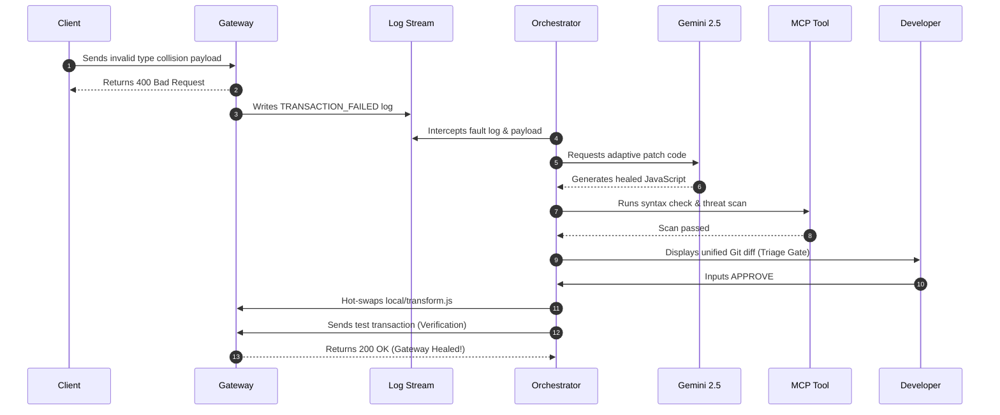

# Presentation Deck: SchemaAdapt-AI Self-Healing Gateway

This document serves as a comprehensive presentation outline and reference deck for the **SchemaAdapt-AI** project.

---

## 1. Executive Summary & Problem Statement

### The Problem
- **Data Schema Drift**: Upstream services and external clients frequently change data types (e.g., sending an ID as a string instead of an integer) or add undocumented fields without warning.
- **Service Outages**: Traditional API gateways are static. When unexpected schema drift happens, the gateway rejects the transactions, crashing downstream integrations and causing business downtime.
- **Manual Overhead**: Resolving these failures currently requires operations engineers to manually inspect logs, rewrite gateway validation scripts, verify them in staging, and manually deploy patches—a process taking hours.

### The Solution: SchemaAdapt-AI
- An autonomous, self-healing adapter layer operating on **Google ADK 2.0 primitives**.
- It continuously monitors API gateway logs, uses Google Gemini to generate adaptive validation policies on the fly, validates syntax and security checks, and hot-swaps the runtime configuration live under human supervision.

---

## 2. Technical Tech Stack

- **Gateway Layer**: IBM DataPower Developer Docker Container (v10.6.0.0)
  - Configured with a Loopback XML Firewall, custom Style Policies, and an active GatewayScript validation interceptor.
- **Backend Orchestrator**: Python 3.11 & `uv` workspace
  - Coordinates telemetry, graphs state machine transitions, and maintains system memory.
- **Cognitive Engine**: Gemini 2.5 Flash (`google-genai` SDK)
  - Performs schema inference and compiles adaptive, backward-compatible JavaScript patches.
- **Tooling Interface**: Model Context Protocol (FastMCP)
  - Exposes validation checkers, vulnerability/threat scanners, and curl test tools to the state graph.

---

## 3. Component Details & Architecture

```text
┌────────────────────────────────────────────────────────────────────────┐
│                        Local Workspace (Host OS)                       │
│                                                                        │
│   ┌────────────────────┐   ┌─────────────────┐   ┌─────────────────┐   │
│   │  graph_engine.py   │──>│  mcp_server.py  │──>│ patches/staging │   │
│   │  (ADK Orchestrator)│   │  (MCP Toolset)  │   │ _patch.js       │   │
│   └────────────────────┘   └─────────────────┘   └─────────────────┘   │
│             │                                             │            │
│             │ Monitors Logs                               │ Hot-swaps  │
│             ▼                                             ▼            │
│   ┌────────────────────────────────────────────────────────────────┐   │
│   │                 IBM DataPower Gateway (Docker)                 │   │
│   │                                                                │   │
│   │   ┌───────────────────────┐       ┌────────────────────────┐   │   │
│   │   │ config/auto-startup.cfg│       │ local/transform.js     │   │   │
│   │   │ (XML Firewall Service)│       │ (Active GatewayScript) │   │   │
│   │   └───────────────────────┘       └────────────────────────┘   │   │
│   └────────────────────────────────────────────────────────────────┘   │
└────────────────────────────────────────────────────────────────────────┘
```

### Component Roles
1. **`auto-startup.cfg`**: Configures the XML Firewall to listen on port `8000` and pass all incoming traffic through the validation script.
2. **`transform.js`**: The active gateway validation rule file. It rejects malformed requests and prints transaction errors to standard output logs.
3. **`mcp_server.py`**: Hosts modular tools for:
   - Compiling JavaScript patches.
   - Performing Node.js syntax validations.
   - Sweep scanning for security threats (e.g. blocking imports of `fs` or `child_process`).
   - Running live target curl requests to test endpoint health.
4. **`graph_engine.py`**: The state-graph machine implementing 5 functional nodes (Monitor -> Optimize -> Scan -> Triage -> Hot-Swap).

---

## 4. Sequential Flow Lifecycle (The 6 Steps)



---

## 5. Case Study: Resolving the Mismatched Field Fault

### The Fault (Type Collision)
The baseline gateway expected `id` to be a `number`.
An external client sent a payload containing a string:
```json
{
  "id": "ERR_VAL_9988",
  "name": "Alice"
}
```
The gateway crashed the transaction, outputting:
`TRANSACTION_FAILED: type collision for field 'id', expected number, got string`

### The Autonomous Healing Action
1. The Orchestrator captured the failure.
2. Gemini 2.5 was called, analyzing the input schema drift.
3. Gemini generated an updated `transform.js` utilizing JavaScript reflection:
   ```javascript
   var adaptedPayload = {};
   Object.keys(json).forEach(function(key) {
       adaptedPayload[key] = json[key];
   });
   ```
   This removed the strict check for `number` while maintaining the mapping of all fields.
4. The scanner verified zero syntax errors and confirmed there were no insecure system calls.
5. The engineer approved the patch.
6. The orchestrator replaced the production file, healing the pipeline immediately.

---

## 6. Execution Token Statistics & Cost Analysis

During the self-healing validation lifecycle:
- **Optimization Runs**: `2`
- **Tokens Consumed per Run**: `1,178 tokens`
- **Total Task Token Consumption**: **`2,356 tokens`**

### Cost Quantification (Gemini 2.5 Flash API pricing)
- **Input Tokens Rate**: `$0.30` per million tokens
- **Output Tokens Rate**: `$2.50` per million tokens
- **Calculation (Prompt vs Candidates breakdown)**:
  - Assuming a standard breakdown of 950 input tokens ($0.000285) and 228 output tokens ($0.000570) per optimization run:
  - **Cost per self-healing optimization**: **`~$0.00085`**
  - **Total task cost (2 runs)**: **`~$0.00171`** (less than **one-fifth of a cent!**)

